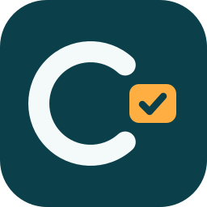

# Cotação de Pedidos

Aplicativo Windows (Windows Forms, .NET 10) que integra o ERP **ETrade** (SQL Server) ao **Google Sheets**
para cotar Pedidos de Compra com fornecedores:

1. O comprador informa **Filial** e **Sequência** do pedido e clica em **Localizar pedido**.
2. **Exportar** cria no Google Drive uma planilha com os itens do pedido. O fornecedor, que não precisa de conta
   Google, recebe o link e preenche **somente** a coluna *Preço* (as demais colunas ficam protegidas).
3. Com o preenchimento concluído, o comprador confere o resumo e clica em **Importar**: os preços são gravados
   no ETrade e o pedido passa da Operação 70 (Pedido de Compra) para a 72 (Cotação Realizada), tudo em **uma única
   transação** (qualquer falha desfaz tudo).
4. **Sobrescrever** arquiva a planilha atual (pasta *Registros Arquivados*) e gera uma nova, quando o pedido mudou
   no ETrade depois da exportação.
5. A aba **Histórico** lista todas as planilhas, ativas e arquivadas.

Cada opção da tela tem um ícone **?** que explica o que ela faz.

## Arquitetura (3 camadas)

```
CotacaoPedidos.Apresentacao  →  CotacaoPedidos.Negocio  ←  CotacaoPedidos.Dados
        (telas)                    (regras + contratos)       (SQL Server + Google)
```

| Projeto | Responsabilidade |
|---|---|
| `CotacaoPedidos.Apresentacao` | Telas Windows Forms. Só conversa com a camada de Negócio. |
| `CotacaoPedidos.Negocio` | Entidades, regras (status da cotação, conferência de itens e preços, vínculo pedido × planilha) e o `CotacaoService`. **Sem dependências externas**: acessa dados só pelas interfaces de `Contratos.cs`. |
| `CotacaoPedidos.Dados` | Implementa os contratos: `ETradeRepository` (SQL Server) e `PlanilhaGoogleRepository` (Google Sheets/Drive). |

Por depender só de interfaces, a camada de Negócio pode ser testada com repositórios falsos, sem banco e sem internet.

## Como executar

Requisitos: Windows, [.NET 10 SDK](https://dotnet.microsoft.com/download), acesso a um banco ETrade (SQL Server) e uma
conta Google.

### 1. Credenciais do Google

1. No [Google Cloud Console](https://console.cloud.google.com/), crie um projeto e ative as APIs **Google Sheets** e
   **Google Drive**.
2. Crie uma credencial **ID do cliente OAuth** do tipo **Aplicativo para computador** e baixe o JSON.
3. Salve-o como `CotacaoPedidos.Apresentacao/credentials.json` (use `credentials.example.json` como referência do formato).

Na primeira execução o navegador abre para você autorizar o acesso; o token fica em `token_store/`, ao lado do
executável.

### 2. Configuração do ETrade

Copie `CotacaoPedidos.Apresentacao/appsettings.example.json` para `appsettings.json` e preencha:

- `ConnectionString`: conexão com o banco ETrade.
- `OperacaoCotacaoRealizadaIde`: o `Ide` da Operação 72 na tabela `Operacao` do **seu** banco
  (`SELECT Ide FROM Operacao WHERE Codigo = 72`). O programa confere esse valor ao abrir e recusa iniciar se estiver errado.

As duas configurações também aceitam variáveis de ambiente (têm prioridade sobre o arquivo):
`ETRADE_CONNECTION_STRING` e `ETRADE_OPERACAO_COTACAO_REALIZADA_IDE`.

### 3. Rodar

```
dotnet run --project CotacaoPedidos.Apresentacao
```

> ⚠️ O **Importar escreve no banco do ERP**. Teste primeiro em um banco de homologação.

### 4. Criar o executável e o atalho na área de trabalho

Para abrir o programa com duplo clique, sem o Visual Studio nem o `dotnet run`:

**a) Publique** (gera o `.exe` e as DLLs numa pasta fixa do seu usuário). Rode na pasta do repositório, **depois** de ter criado o `credentials.json` e o `appsettings.json` (passos 1 e 2):

```powershell
dotnet publish CotacaoPedidos.Apresentacao -c Release -o "$env:LOCALAPPDATA\CotacaoPedidos"
```

O `credentials.json` e o `appsettings.json` são copiados junto para a pasta publicada. Se você ainda não os tinha criado, copie-os para lá depois, ao lado do `CotacaoPedidos.Apresentacao.exe`.

**b) Crie o atalho** na área de trabalho:

```powershell
$exe = "$env:LOCALAPPDATA\CotacaoPedidos\CotacaoPedidos.Apresentacao.exe"
$destino = Join-Path ([Environment]::GetFolderPath('Desktop')) "Cotação de Pedidos.lnk"
$atalho = (New-Object -ComObject WScript.Shell).CreateShortcut($destino)
$atalho.TargetPath = $exe
$atalho.WorkingDirectory = Split-Path $exe
$atalho.IconLocation = "$exe,0"   # ícone do programa (o logo)
$atalho.Save()
```

Ou pelo Explorer: abra a pasta `%LOCALAPPDATA%\CotacaoPedidos`, clique com o botão direito em `CotacaoPedidos.Apresentacao.exe` e escolha **Enviar para → Área de trabalho (criar atalho)**.

**c) Primeira execução:** o navegador abre uma vez para você autorizar o acesso ao Google; o login fica salvo em `token_store/`, ao lado do `.exe`.

**Atualizar para uma versão nova:** rode o `dotnet publish` do passo (a) de novo, na mesma pasta. Ele troca só o programa; a configuração e o login continuam.

> ⚠️ A pasta publicada contém **segredos** (`credentials.json`, `appsettings.json` e `token_store/`). Não a compartilhe, não a envie ao GitHub e não publique dentro da pasta do repositório.

> ℹ️ O programa publicado precisa do **.NET 10 Desktop Runtime** instalado no computador onde vai rodar.

## Segurança

- `credentials.json`, `appsettings.json` e `token_store/` contêm segredos e **estão no `.gitignore`**. Nunca os
  versione; só os modelos `*.example.json` vão para o repositório.
- As consultas SQL são todas parametrizadas e a importação roda numa transação única.
- Os comentários do código citam "seções da especificação", referentes a um documento funcional interno que não é
  publicado.

## Observações

- O projeto foi escrito para o esquema do ETrade (tabelas `Movimento`, `Movimento_Produto`, `Produto`, `Filial`,
  `Operacao`) e para o fluxo de Operações 70 → 72 descrito acima. Para outro ERP, só a camada de Dados precisa mudar.
- A versão e a data da compilação aparecem no rodapé da tela (`Version` em `CotacaoPedidos.Apresentacao.csproj`).
  O histórico de versões está no [CHANGELOG.md](CHANGELOG.md).
